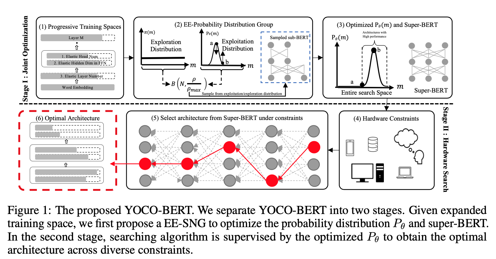
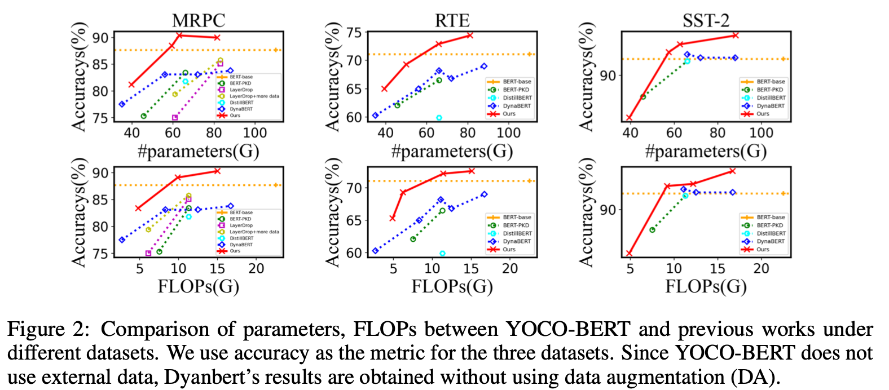

# You Only Compress Once: Towards Effective and Elastic BERT Compression via Exploit-Explore Stochastic Nature Gradient ([paper](https://arxiv.org/abs/2106.02435)) 
```
@misc{zhang2021compress,
      title={You Only Compress Once: Towards Effective and Elastic BERT Compression via Exploit-Explore Stochastic Nature Gradient}, 
      author={Shaokun Zhang and Xiawu Zheng and Chenyi Yang and Yuchao Li and Yan Wang and Fei Chao and Mengdi Wang and Shen Li and Jun Yang and Rongrong Ji},
      year={2021},
      eprint={2106.02435},
      archivePrefix={arXiv},
      primaryClass={cs.CL}
      } 
```
## Overview

This repository is the official implementation of You Only Compress Once: Towards Effective and Elastic BERT Compression via Exploit-Explore Stochastic Nature Gradient

>📋  We propose a novel approach, YOCO-BERT, to achieve compress once and deploy everywhere. Compared with state of-the-art algorithms, YOCO-BERT provides more compact models, yet achieving superior average accuracy improvement on the GLUE.
<div align=center></div>

## Requirements

-  Python > 3.6
-  Pytorch = 1.7.0
-  transformers = 3.5.0


## Training

To train the super-BERTs in the paper, run this command:

```train
python train_superbert.py --cfg /path_to_superbert_training_config/config.yaml
```


## Searching

To search the optimal sub-BERTs given any constraints in the paper, run this command:

```search
python search_subbert.py --cfg /path_to_subbert_searching_config/config.yaml
```


## Evaluation

The evaluation results will be reported after the searching process.

## Config

We release all the traning and searching configs in [config](./config)

## Results

Our model achieves the following performance on :

### [GLUE](https://gluebenchmark.com/)

#### Results given various FlOPs and parameters.
<div align=left></div>

#### Results under common constraints (compress to no more than 66M)

 | Datasets         | SST-2  |  MRPC  |  CoLA  |  RTE  |  MNLI  | QQP  | QNLI  |
 | :------------------: |:------------------: | :------------------:| :------------------: | :------------------:| :------------------:| :------------------: | :------------------:|
 | Results   |    92.8         |  90.3        |  59.8         |  72.9         |  82.6         |  90.5         |  87.2        |


>📋  The detailed metrics used in this code are reported in the paper.

## Licence

This repository is released under the MIT license. See [LICENSE](./LICENSE) for more information.

## Contact
Any problem regarding this code re-implementation, feel free to contact the first author: shaokunzhang529@gmail.com

